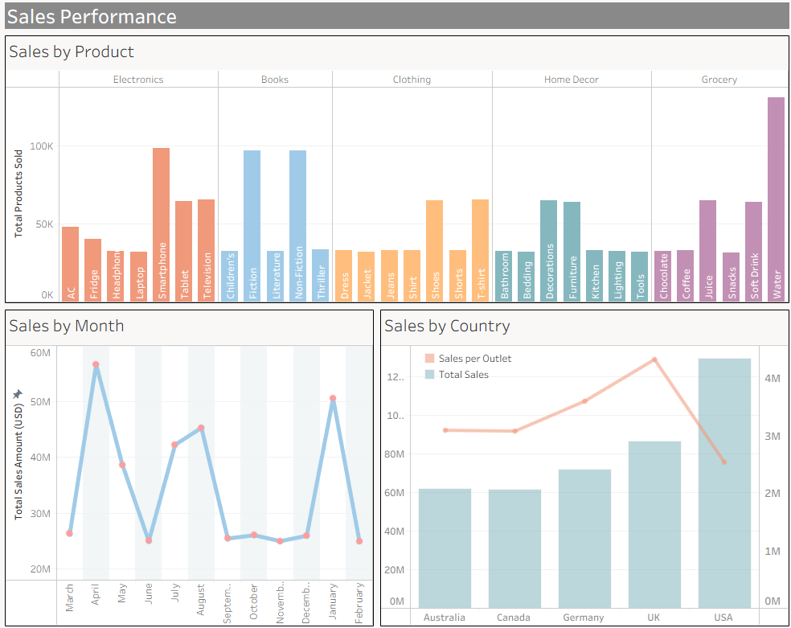
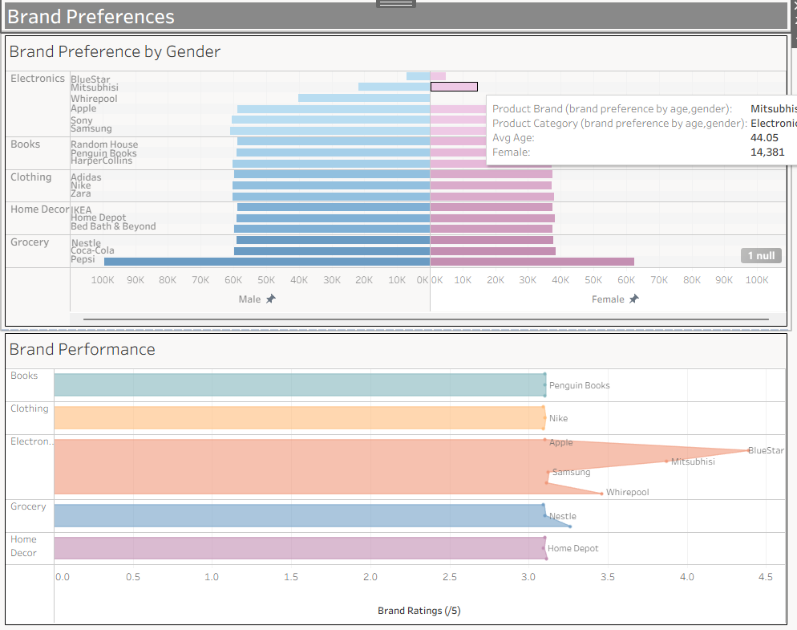
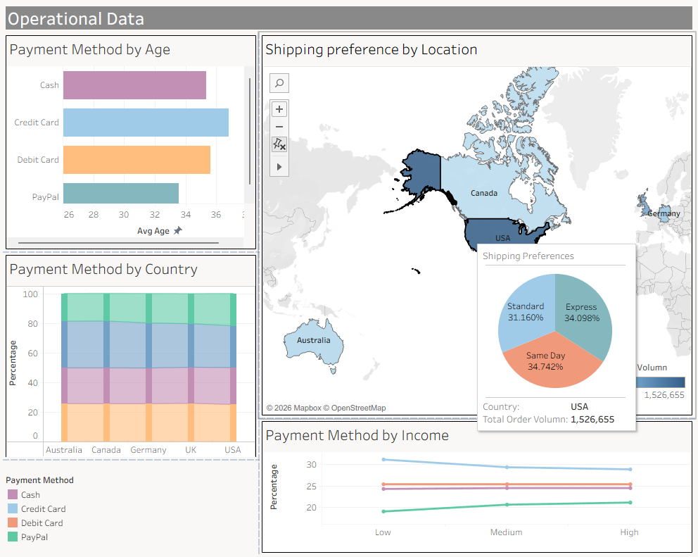

# Retail Sales Analysis

SQL and Tableau analysis of retail sales data exploring customer preferences and geographic trends.

## Tools Used
- SQL (data querying and aggregation)
- Tableau (visualisation)

## Dataset
Retail sales dataset containing customer demographics, sales data, shipping & payment preferences across 5 countries.

## Dashboards

### Sales Performance

### Brand Preferences

### Operational Insights

## Key Findings

Sales Performance
Electronics and Books are the strongest performing product categories by sales volume. While Water records high unit sales in the Grocery category, this is not a strategically significant metric given its low price point and commodity nature.
The UK stands out as the most efficient market, achieving the highest sales per outlet despite not having the largest total sales — indicating strong outlet-level performance. The USA leads in total sales but has a lower sales-per-outlet ratio, suggesting that performance optimisation across its larger outlet network could yield significant gains.
Monthly sales show a cyclical pattern, with peaks likely driven by holiday seasons and promotional periods. However, drawing strong conclusions about long-term sales trends requires data spanning multiple years, which would allow seasonal patterns to be separated from underlying growth or decline.

Brand & Category Performance
Electronics brands significantly outperform all other categories in brand ratings, making Electronics the key product category to prioritise in marketing and inventory investment. Books, Clothing, Home Decor, and Grocery perform at a broadly similar level to each other, suggesting no single standout category among them.
Gender-based brand preference trends are consistent across most categories — however, Electronics shows a notable gap where male customers dominate engagement. To attract more female customers, expanding the electronics product range to include brands or product types with stronger female appeal could be a valuable growth strategy.

Payment Method Insights
PayPal is the most common payment method among younger customers, while Credit Card is preferred by older demographics. When combined with age-based brand preference data, this presents a targeted marketing opportunity — offering card-linked deals or PayPal promotions tied to relevant brands could effectively attract and retain specific customer segments.
Payment method distribution varies by income level and country. Higher-income customers show a stronger preference for Credit Card, while lower-income groups lean more toward PayPal and Debit Card — useful for tailoring checkout experiences and financial product partnerships. Overall, Credit Card is the most used payment method globally. Country-level splits are most pronounced in Australia and Canada, and least significant in the USA where usage is more evenly distributed. Understanding these regional differences allows the business to localise payment promotions and partnerships more effectively.

Shipping & Operational Insights
Standard delivery is the least preferred shipping method across all countries, with Express and Same Day shipping being more popular among customers. The USA accounts for the highest order volume by a significant margin. These findings can directly inform operational decisions — such as prioritising logistics partnerships with express and same-day carriers, and negotiating better rates with shipping vendors based on volume and method demand.
